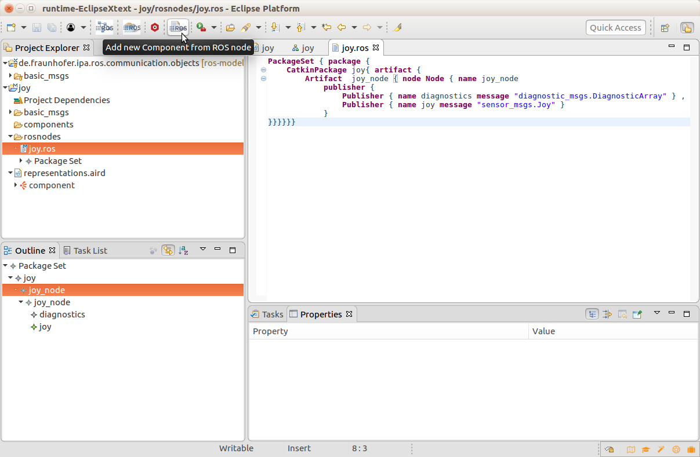
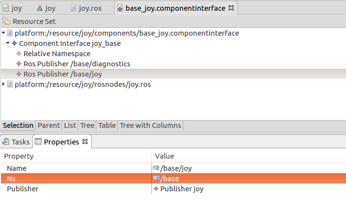

## Create a component from a node

Select the components folder of your package and choose a name for your component

Give a name for the component and (if needed) the namespace

open the browser and choose a valid .ros file as input to be referenced (under the folder rosnodes)

Your component will be automatically created, in case you want to modify the default remaps of the interfaces you can edit the file using the EMF editor

(for SeRoNet )

in the src-gen folder the rosinterfacespool file will be automatically generated
